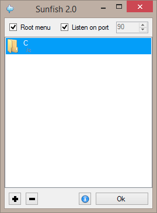
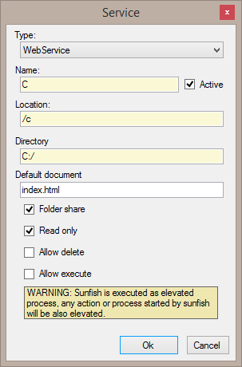

Sunfish
===============

A lightweight & portable web & file server in C#

||
|:--:|
| Main screen |

With Sunfish you can share any folder on the computer and also static web pages.

Select the port and click "listen to port" to start the service. Remote connections will be allowed. Add a path to share and you can open this path using the computer IP.

The root menu is a small directory of available services, can be disabled, but no service can be used as root.

Sunfish embeds Json.Net from Newtonsoft.

### Editor

||
|:--:|
| Editor screen |

**Type:**
Type of service, Version 2.0 only have the standard WebService but it can be added throught plugins or next versions.

**Name:**
Name of the service, only for display, and for the root menu.

**Location:**
Location of the service in the web path.

**Directory:**
The filesystem directory to expose

**Default document:**
The default index docuent.

**Folder Share:**
Allow folder share (directory frontend), if disabled the behaviour is similar to a web share.

**Read only:**
The shared is read only (no modifications allowed), if disabled the upload and rename of files is enabled.

**Allow delete:**
The files can be deleted, requires non read only configuration.

**Allow execute:**
Execute the file on the server side (See warinigs).

### Modifications and plugin development

A fresh compiled Sunfish.exe does not contain the default resources, place the $sunfish directory on the same path of the .exe with the resources or seal it into the .exe
To seal resources open sunfish.exe and open the root webpage on a browser. Enter path /$sunfish/info and you will find the seal link. A new sunfish.exe will be generated with the resources inside.

For [Plugin development](doc/plugins.md) open the plugins.md document inside doc folder.

### Notes

A list o available computer IPs are show on the About... button (near the OK)

| Waring |
|:--:|
| Sunfish uses the C# web server implementation, and this implementation requires elevated user to allow remote computers connections, will be dropped on next versions |

### Roadmap
In future version of Sunfish .Net Framework will be replaced by .Net Core that will add the next great changes:

- Add Web administration panel with a lot more of configuration options.
- Custom resources for plugins.
- Reduce the windows GUI to a more basic version embedding the administration panel.
- Add alternative GUI for Linux / Macos or switch to electron app.
- A way for Dynamic Web Pages.
